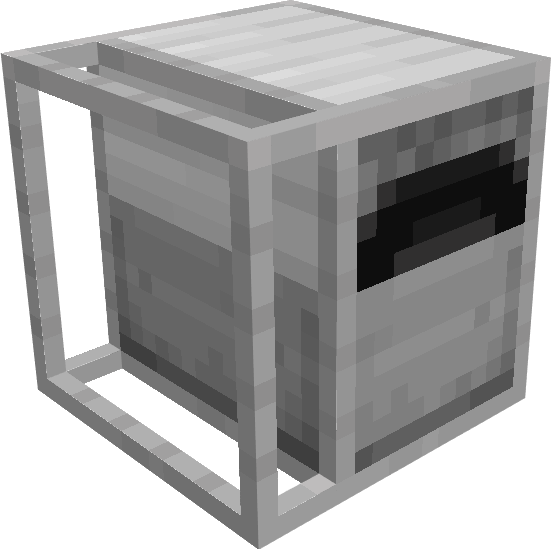

# LavaFurnace

Adds a new Lava Furnace to minecraft. This furnace uses hot fluids to smelt items and has the following features:
- Smelts up to 25 items
- Smelts items 4 times faster than a regular furnace
- The hotter the fluid, the faster the furnace smelts
	
# License

[MIT License](LICENSE).
